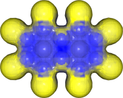
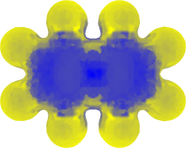
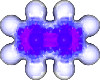
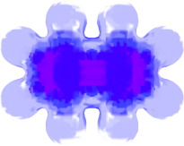

# Tutorials
## I. Naphtalene with default grid and 1 angström radius surface

1. Generation of the com files

```
python3 ../nics_prep_angular.py -r 1 naphtalene.xyz 
```

2. Gaussian calculation

2.1. Transfert of the _com_ files to the cluster (if needed)

```
scp *.com REMOTE_MACHINE:INPUT_PATH
```

2.2. Run gaussian on all _com_ files

#  ☕☕☕

2.3. Transfert of the _log_ files back from the cluster (if needed)

```
scp REMOTE_MACHINE:INPUT_PATH/*.log .
```

3. Gathering of the computed NICS

```
python3 ../nics_harv.py input_batch_00000.log
```
4. View of the results
```
python3 ../nics_view.py
```
Viewing can be done with different rendering:


Auto setup and shiny rendering (default):
```
python3 ../nics_view.py
```



Auto setup and mate rendering:
```
python3 ../nics_view.py -m
```



Isocontour and shiny rendering:
```
python3 ../nics_view.py -c iso
```



Isocontour setup and mate rendering:
```
python3 ../nics_view.py -m -c iso
```


